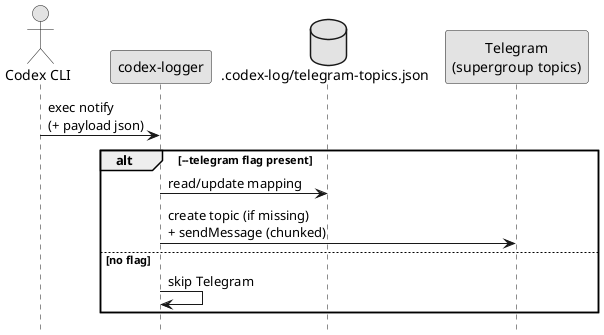

# epic-local-00002 Telegram Topics Delivery — 要件定義（WHAT / WHY）

## 目的（Initiativeとの紐づき） (必須)
- Initiative のどの Goal / Metric に効くか:
  - Metric 2（最終アウトプットが Telegram topic へ到達）
- この Epic が提供する能力（E2E）:
  - `thread-id`（セッション）単位で Telegram topic を作成/再利用し、`last-assistant-message` のみを送信できる
  - 4096 文字超過時に、改行境界優先＋フォールバック強制分割で全文を複数投稿できる

## ユースケース（User journeys） (必須)
- Happy path:
  - Telegram 設定あり → 初回 `thread-id` で topic 作成 → 以後は mapping を再利用して投稿
- 例外/運用シナリオ:
  - Telegram 設定が無い（ローカル保存のみで継続）
  - Telegram API 失敗（429/ネットワーク）でもローカル保存は成功させる（ベストエフォート）
  - 超長文（改行無し 4096 超）でも送信できる（強制分割）
  - `--telegram` フラグが無い場合は、Telegram 設定があっても送信しない（ログ保存は継続）

### UML（任意） (任意)

## 要求（Epic-level requirements） (必須)
> “Issueに分割して実装される前提の、E2E要求” を列挙する。

- E-RQ-001（MUST）: `thread-id` 単位の topic を作成/再利用できる（mapping 永続化）
- E-RQ-002（MUST）: 送信するのは `last-assistant-message` のみ（入力/トークン等は送らない）
- E-RQ-003（MUST）: 4096 超過時に分割送信できる（改行優先＋フォールバック強制分割 + 連番付与）
- E-RQ-004（SHOULD）: mapping 更新は同時実行でも破損しない（ロック＋原子的置換）
- E-RQ-005（MUST）: Telegram 送信はフラグ `--telegram` 指定時のみ行う（フラグ無しなら送信しない）
- E-RQ-006（MUST）: `--telegram` 指定があるのに env が不足している場合は、送信せず stderr に警告を出す（ローカル保存は継続）

## 受け入れ条件（Epic DoD / E2E） (必須)
- E-AC-001:
  - Given: Telegram 設定（env）が揃っており、mapping が存在しない
  - When: handler を実行する
  - Then: topic が作成され、`last-assistant-message` が投稿され、mapping が保存される
  - 観測点（UI/HTTP/DB/Log 等）:
    - Telegram API（モック）
- E-AC-002:
  - Given: `last-assistant-message` が 4096 文字を超える
  - When: handler を実行する
  - Then: 複数投稿で全文が送られる（分割境界は改行優先、各投稿に `(i/n)` 連番が付与される）
- E-AC-003:
  - Given: Telegram 設定（env）が揃っているが `--telegram` フラグが無い
  - When: handler を実行する
  - Then: Telegram API が呼ばれない（送信しない）
- E-AC-004:
  - Given: `--telegram` フラグがあるが Telegram 設定（env）が不足している
  - When: handler を実行する
  - Then: Telegram API は呼ばれず、stderr に「無効化理由」が出力される（exit code はローカル保存の成否に従う）

## スコープ (必須)
- MUST:
  - Telegram topics（forum）を使った送信
- MUST NOT:
  - 入力メッセージ（`input-messages`）や raw JSON の Telegram 送信
- OUT OF SCOPE:
  - Telegram 以外の通知チャネル

## 境界（Always / Ask / Never） (必須)
- Always（常に守る）:
  - Telegram はベストエフォート（ローカル保存優先）
- Ask（迷ったら相談）:
  - 送信対象イベントの拡張（未知 `type` を送るかどうか）
- Never（絶対にしない）:
  - 機密/入力を Telegram に送る

## 非機能要件（NFR） (必須)
- 性能:
  - Bot API 呼び出し回数を最小化（topic は mapping で再利用）
- 信頼性/整合性:
  - mapping はロック＋原子的置換で破損しにくくする
- セキュリティ:
  - `TELEGRAM_BOT_TOKEN` 等は環境変数で注入し、ログに出さない
- 運用性（監視/アラート/Runbook）:
  - 失敗は stderr warn（非致命）として観測できる
  - env 不足時も stderr warn で理由が分かる

## 依存 / 影響範囲 (必須)
- 影響コンポーネント（FE/BE/DB/ジョブ/外部連携）:
  - Telegram（外部）
- 外部依存（他チーム/外部API/権限/契約）:
  - Telegram supergroup（forum topics 有効化）+ Bot に topic 作成権限
- 互換性（破壊的変更の有無 / バージョニング方針）:
  - topic 命名は運用互換（後から変えると topic が増える）
  - ...

## リスク/懸念（Risks） (任意)
- R-001: <リスク>（影響: ... / 対応: ...）
- ...

## 未確定事項（TBD） (必須)
- 該当なし（意思決定済み）
  - topic 命名: `../../adrs/adr-00002-telegram-topic-naming.md`
  - 分割連番: `../../adrs/adr-00007-telegram-chunk-numbering.md`
  - exit code: `../../adrs/adr-00008-telegram-failure-exit-codes.md`

## Definition of Ready（着手可能条件） (必須)
- [ ] Initiative との紐づき（Goal/Metric）が明記されている
- [ ] E-RQ と E-AC があり、E2Eで観測可能な形になっている
- [ ] MUST/MUST NOT/OUT OF SCOPE が書けている
- [ ] Always/Ask/Never が書けている
- [ ] NFR が書けている（該当なしの場合は理由がある）
- [ ] 依存/影響範囲が書けている
- [ ] 未確定事項が「質問/選択肢/推奨案/影響範囲」で整理されている

## Definition of Done（完了条件） (必須)
- E-AC が満たされている（統合動作として確認できる）
- （必要なら）ロールアウト/移行が完了している
- （必要なら）監視/アラート/Runbook が整備されている
- フォローアップが Issue として切られている（必要な分）

## 省略/例外メモ (必須)
- 該当なし
