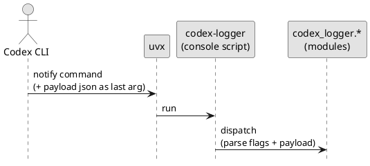
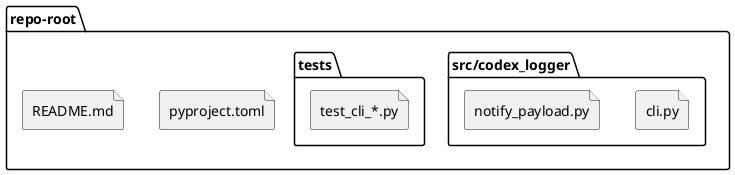
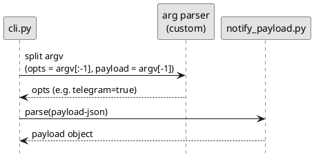

# epic-local-00003 Packaging and CLI — 設計（HOW）

## 全体像（Context / Scope） (必須)
- 対象境界（モジュール/責務/データ境界）:
  - 目的は「配布/実行可能な CLI」と「壊れにくい引数契約」を提供すること（機能の中身は他 Epic）
  - 本 Epic の SoR（正）はコード（pyproject + src layout + console script）と README
  - `.codex-log/` 出力や Telegram 連携の詳細は、それぞれの Epic の設計に委譲する
- 既存フローとの関係:
  - Codex CLI `notify` が外部コマンドを実行する際、末尾に JSON payload を追加する前提で動作する
- 影響範囲（FE/BE/DB/ジョブ/外部連携）:
  - ローカル: `codex-logger` 実行（uvx）
  - 外部: uv/uvx（実行環境）

### UML（任意） (任意)

## 契約（API/イベント/データ境界） (必須)
### CLI（本 Epic の主契約）
- コマンド名: `codex-logger`
- 引数:
  - `--telegram`（任意）: Telegram 送信を有効化する（実際の送信は Epic 00002）
  - `<payload-json>`（必須）: notify payload（**末尾引数**）
- help/version:
  - `--help` / `--version` は payload なしで動作する
  - `--help` / `--version` は最優先で短絡終了する（`--telegram` 等が付いていても payload を要求しない）

#### 引数解釈のルール（壊れにくさのための実装方針）
- `payload-json` は **常に `argv[-1]`** として扱う（Codex が末尾に付与するため）
- `argv[:-1]` から `--telegram` 等のフラグを解析する（フラグは payload の前に置く）
- `--help` / `--version` の場合は早期終了し、payload を要求しない

### Event（ある場合）
- なし（Codex notify の payload を受信するが、本 Epic は配布/CLI を扱う）

### データ境界（System of Record / 整合性）
- SoR（正のデータ）:
  - Git リポジトリ内の `pyproject.toml` / `src/` / `README.md`
- 整合性モデル（強整合/結果整合）:
  - N/A（ローカルファイルや外部APIの整合性は別 Epic）

## データモデル設計 (必須)
- 変更点（テーブル/カラム/インデックス）:
  - なし（ログファイル/マッピングは別 Epic）
- バリデーション/不変条件（Invariant）:
  - CLI は payload を JSON としてパースできること（不正 JSON は usage error）
  - `--telegram` はフラグであり、payload と混同しないこと
- Packaging/依存:
  - build backend は hatchling（`adr-00004`）
  - `.env` 自動読込のため `python-dotenv` を依存として含める（`adr-00005`。環境変数が優先）

### UML（任意） (任意)

## 主要フロー（高レベル） (必須)
- Flow A（E-AC-001）:
  1) `uvx --from <source> codex-logger ...` で console script を解決/起動
  2) `argv` を解析（help/version は早期終了）
  3) `payload-json = argv[-1]` を JSON としてパースし、内部処理へ渡す（保存/配信は別 Epic）
- Flow B（E-AC-002）:
  - `--telegram` フラグを付与した場合でも、payload を末尾から取得して解釈できる

### UML（任意） (任意)

## 失敗設計（Error handling / Retry / Idempotency） (必須)
- 想定故障モード:
  - payload が無い（argv が空 / フラグのみ）
  - payload が JSON としてパースできない
  - `--from` の解決に失敗（uvx 側のエラー）
- リトライ方針:
  - 本 Epic では実装しない（uvx の再実行/キャッシュに委ねる）
- 冪等性/重複排除:
  - N/A（保存/配信の冪等性は別 Epic）
- 部分失敗の扱い（補償/再実行/整合性）:
  - usage error は非0（例: exit code 2）で即時終了する

## 移行戦略（Migration / Rollout） (必須)
- 戦略（例: expand → backfill → switch → contract）:
  - N/A（まずは `uvx --from .` で動作確認 → GitHub ref を固定して運用へ）
- 二重書き/読み替え（必要なら）:
  - なし
- ロールバック方針:
  - `--from` の ref を戻す（`@tag` / `@commit` を切り替える）

## 観測性（Observability） (必須)
- ログ（必須キー、マスキング、サンプリング）:
  - stderr に「引数誤り」「JSON パース失敗」などの最小限のメッセージを出す（機微情報は出さない）
- メトリクス（成功/失敗/レイテンシ/処理件数）:
  - なし（MVP）
- アラート（しきい値/対応導線）:
  - なし（MVP）

## セキュリティ / 権限 / 監査 (必須)
- 役割モデル:
  - ローカル実行（ユーザー権限）
- 監査ログ:
  - N/A（保存/監査は別 Epic）
- PII/機微情報の扱い:
  - env（`TELEGRAM_BOT_TOKEN` 等）をログに出さない

## テスト戦略（Epic） (必須)
- Unit:
  - CLI 引数解析（末尾 JSON / `--telegram` / help/version）を pytest で検証
- Integration:
  - `uvx --from . codex-logger --help` を E2E として確認（任意: 実装時に追加）
- E2E:
  - Codex `notify` 設定例は README に記載し、手動で確認できるようにする
- 回帰/負荷:
  - なし（MVP）

### E-AC → テスト対応 (必須)
- E-AC-001 → `tests/test_cli_help.py::test_help_exits_zero`
- E-AC-002 → `tests/test_cli_parse.py::test_parse_with_telegram_flag_and_payload`
- E-AC-003 → `tests/test_cli_version.py::test_version_exits_zero_without_payload`

## ADR index（重要な決定は ADR に寄せる） (必須)
- adr-00001-notify-logger-output-and-telegram: 出力先/summary/Telegram topics/分割送信の方針（Initiative）
- adr-00004-python-build-backend: build backend（hatchling）
- adr-00005-dotenv-loading-strategy: `.env` 自動読込（env 優先、`<cwd>/.env` のみ）
- adr-00006-uvx-ref-pinning-strategy: uvx の ref 固定（tag 基本 + 緊急時 sha）

## 未確定事項（TBD） (必須)
- 該当なし（意思決定済み: `adr-00005-dotenv-loading-strategy`）

## 省略/例外メモ (必須)
- 該当なし
