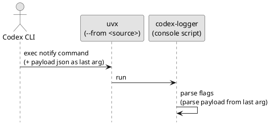

# epic-local-00003 Packaging and CLI — 要件定義（WHAT / WHY）

## 目的（Initiativeとの紐づき） (必須)
- Initiative のどの Goal / Metric に効くか:
  - Metric 1（ローカルログ生成 100%）: notify handler を **誰でも再現できる実行形**として提供することで、導入・再実行・検証を容易にする
  - Metric 2（最終アウトプット配信）: Telegram を含む外部連携を **フラグで明示的に有効化**できる CLI 契約を提供する
- この Epic が提供する能力（E2E）:
  - `codex-logger` コマンドを **uvx 経由で実行**できる（GitHub 指定 / ローカルパス指定）
  - GitHub 指定では `@tag` / `@commit` で ref を固定できる（再現性）
  - Codex CLI `notify` の「末尾に JSON payload が追加される」前提と共存できる CLI（末尾引数=JSON、任意フラグ=前置）

## ユースケース（User journeys） (必須)
- Happy path:
  - `notify` を `uvx --from <source> codex-logger [--telegram]` に設定し、Codex 実行のたびに handler が呼ばれる
  - 手動で `uvx --from <source> codex-logger '<payload-json>'` を実行し、デバッグ/再生成できる
- 例外/運用シナリオ:
  - GitHub ref を固定して、ある時点の実装で再現実行できる（`@v0.1.0` / `@<sha>`）
  - `--telegram` フラグが無い場合は Telegram を送らない（ログ保存は常に行う: Initiative の別 Epic で担保）
  - CLI の引数誤り（payload 無し/JSON 不正）を、分かりやすいエラーで検知できる

### UML（任意） (任意)

## 要求（Epic-level requirements） (必須)
> “Issueに分割して実装される前提の、E2E要求” を列挙する。

- E-RQ-001（MUST）: リポジトリは PEP 517 対応の Python パッケージとして成立し、`codex-logger` の console script を提供する
- E-RQ-002（MUST）: `uvx --from git+https://github.com/<owner>/<repo>[@<ref>] codex-logger ...` で実行できる（ref は tag/commit を許容）
- E-RQ-003（MUST）: `uvx --from <local-path> codex-logger ...` で実行できる（ローカル clone を指せる）
- E-RQ-004（MUST）: CLI は `--telegram`（任意）を受け付け、**末尾引数を notify payload JSON** として解釈できる（追加フラグと共存）
- E-RQ-005（SHOULD）: README に uvx 実行例、Codex `notify` 設定例、必要な環境変数（Telegram）と注意点（機密）を記載する
- E-RQ-006（SHOULD）: 最低限の自動テスト（CLI 引数解釈）を持ち、`uv run pytest` 等でローカル実行できる

## 受け入れ条件（Epic DoD / E2E） (必須)
- E-AC-001:
  - Given: リポジトリをローカルにチェックアウトしている
  - When: `uvx --from . codex-logger --help` を実行する
  - Then: ヘルプが表示され、exit code 0 で終了する
  - 観測点:
    - stdout / exit code
- E-AC-002:
  - Given: `--telegram` フラグと notify payload JSON（末尾引数）が与えられる
  - When: `codex-logger --telegram '<payload-json>'` を実行する
  - Then: `--telegram` が payload と誤認されず、payload が JSON として解釈される（引数解釈が成立する）
  - 観測点:
    - 自動テスト（CLI パースのテスト）
- E-AC-003:
  - Given: payload が無い
  - When: `codex-logger --version`（または `codex-logger --telegram --version`）を実行する
  - Then: バージョンが表示され、exit code 0 で終了する（payload を要求しない）

## スコープ (必須)
- MUST:
  - Python packaging（`pyproject.toml`）と console script（`codex-logger`）
  - CLI 契約（`--telegram` + 末尾 JSON payload）
  - README（導入/運用の最小セット）
- MUST NOT:
  - `.codex/` 配下の設定やファイルを変更しない
- OUT OF SCOPE:
  - PyPI への公開（まずは uvx の git/local source 実行を優先）
  - OS 通知の表示（このプロジェクトでは行わない）

## 境界（Always / Ask / Never） (必須)
- Always（常に守る）:
  - CLI コマンド名は `codex-logger` とする
  - notify payload は「末尾引数」を JSON として扱う（Codex の付与仕様と共存）
- Ask（迷ったら相談）:
  - 依存追加（HTTP クライアント等）と、公開/配布範囲（PyPI など）
- Never（絶対にしない）:
  - 破壊的・不可逆な Git 操作（履歴改変/強制更新など）

## 非機能要件（NFR） (必須)
- 性能:
  - 起動時間を過度に悪化させない（uvx の解決/インストール時間以外は軽量に）
- 信頼性/整合性:
  - 引数解釈（末尾 JSON/任意フラグ）が壊れない（互換性を守る）
- セキュリティ:
  - Telegram トークン等の機微情報をログ出力しない（環境変数で注入）
- 運用性（監視/アラート/Runbook）:
  - README に導入手順とトラブルシュートの入口（例: `--help` / env）を用意する

## 依存 / 影響範囲 (必須)
- 影響コンポーネント（FE/BE/DB/ジョブ/外部連携）:
  - ツールの配布/実行（uvx）
- 外部依存（他チーム/外部API/権限/契約）:
  - uv/uvx（クライアント環境）
- 互換性（破壊的変更の有無 / バージョニング方針）:
  - CLI（`codex-logger [--telegram] <payload-json>`）の互換性は最重要（Codex notify 設定が壊れるため）

## リスク/懸念（Risks） (任意)
- R-001: uvx の挙動差（影響: 実行できない / 対応: README に要件（uv/uvx バージョン）と代替手順を記載）
- R-002: CLI 契約の破壊（影響: notify が動かない / 対応: 引数パースの自動テストを必須化）

## 未確定事項（TBD） (必須)
- 該当なし（意思決定済み: `../../adrs/adr-00004-python-build-backend.md`）

## Definition of Ready（着手可能条件） (必須)
- [ ] Initiative との紐づき（Goal/Metric）が明記されている
- [ ] E-RQ と E-AC があり、E2Eで観測可能な形になっている
- [ ] MUST/MUST NOT/OUT OF SCOPE が書けている
- [ ] Always/Ask/Never が書けている
- [ ] NFR が書けている（該当なしの場合は理由がある）
- [ ] 依存/影響範囲が書けている
- [ ] 未確定事項が「質問/選択肢/推奨案/影響範囲」で整理されている

## Definition of Done（完了条件） (必須)
- E-AC が満たされている（統合動作として確認できる）
- （必要なら）ロールアウト/移行が完了している
- （必要なら）監視/アラート/Runbook が整備されている
- フォローアップが Issue として切られている（必要な分）

## 省略/例外メモ (必須)
- 該当なし
