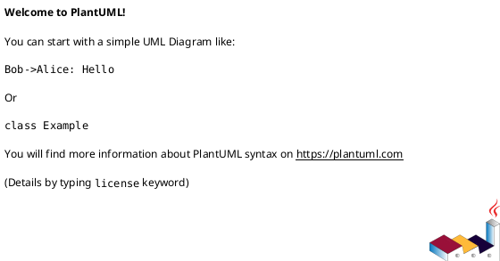

# init-local-00001 Codex Notify Json Logger — 計画（Roadmap / Epics）

## ロードマップ（マイルストーン） (必須)
- M1: 2026-02-24 - Initiative 仕様（requirement/design/plan）+ ADR 初版
- M2: TBD - ローカル保存（`.codexlog/logs` + `summary.md` フレッシュ生成）を E2E で提供
- M3: TBD - Telegram topics 連携（セッション単位 topic + 分割送信）を提供
- M4: TBD - 運用整備（README、設定例、テスト拡充）

## Epic 分解（候補） (必須)
- epic-local-00001-local-logging-and-summary:
  - 狙い（どの Goal/Metric に効くか）:
    - Metric 1（ログ生成 100%）の達成
  - 成果物（E2Eで提供するもの）:
    - `notify` payload を受け取り `.codexlog/logs/*.md` を生成できる
    - `.codexlog/summary.md` を毎回削除→再生成できる
  - 依存:
    - Codex CLI `notify` の設定（どのイベントで呼ぶか）
- epic-local-00002-telegram-topics-delivery:
  - 狙い:
    - Metric 2（最終アウトプット配信）の達成
  - 成果物:
    - `thread-id`（セッション）単位で topic を作成/再利用して送信できる
    - 4096 文字超過時に改行境界で分割して全文送信できる
  - 依存:
    - Telegram supergroup（forum topics 有効化）
    - Bot 権限（topic 作成）
    - `TELEGRAM_BOT_TOKEN`, `TELEGRAM_CHAT_ID`
- epic-00003-packaging-and-docs:
  - 狙い:
    - 導入と運用の安定化
  - 成果物:
    - README（設定例、`.env`、`notify` 設定例）
    - テスト/CI の最低限整備
  - 依存:
    - 実装言語/配布形態の決定（Node/Python/binary など）

## 順序と理由（Sequencing） (必須)
- なぜこの順番か（依存/リスク/価値提供）:
  - ローカル保存が SSOT（必達）で、Telegram は任意（外部依存/権限/漏洩リスク）なので後回しにする
- 並行できるもの / できないもの:
  - 並行可: Telegram の API 仕様調査、topic 命名規則検討
  - 並行不可: ローカル保存のファイル形式/命名が固まらないと、summary 形式と Telegram 送信の整形が確定しない

### UML（任意） (任意)

## 計測計画（Metrics plan） (必須)
- 計測開始（いつから）:
  - 実装導入直後から
- 計測場所（ダッシュボード/ログ/監視）:
  - ローカル: `.codexlog/logs/` と `summary.md`
  - Telegram: Bot API 応答 + 実送確認
- 成功/失敗の判断タイミング:
  - `agent-turn-complete` を複数回受け取り、ログ生成/summary 再生成/Telegram 配信が揃うこと

## ロールアウト計画（Feature flag / 段階移行） (必須)
- Feature flag:
  - Telegram は環境変数が揃っている場合のみ有効（未設定ならローカル保存のみ）
- 段階公開（カナリア/一部テナント/内部先行など）:
  - まずローカル保存のみで運用し、安定後に Telegram を有効化する
- ロールバック:
  - Telegram 無効化（環境変数を外す）で即時ロールバック可能

## Epic Definition of Ready（Epicに求める着手可能条件） (必須)
- [ ] Epic が Initiative requirement の Goal/Metric に紐づいている
- [ ] Epic requirement に E2E の受け入れ条件（Epic DoD）がある
- [ ] Epic design に契約/API/データ/移行/観測性/テスト戦略の背骨がある
- [ ] Epic plan に Issue 分割（順序/依存/品質ゲート）がある
- [ ] 未確定事項が「質問/選択肢/推奨案/影響範囲」で整理されている

## 依存関係 / ブロッカー (必須)
- D-001: Telegram supergroup topics の前提（解消条件: forum 有効 + Bot 権限付与）
- D-002: token 使用量を扱うか（解消条件: 必要性と取得経路を決定）

## リスク対応計画（Top risks） (任意)
- R-001: <リスク>（対応: ...）
- ...

## 未確定事項（TBD） (必須)
- Q-001:
  - 質問: Telegram topic 名の命名規則はどうするか？
  - 選択肢:
    - A: `Codex <thread-id>`
    - B: `<repo名> <thread-id>`（repo が無ければ cwd basename）
  - 推奨案（暫定）:
    - B
  - 影響範囲:
    - Epic 00002 の実装と運用性

## 省略/例外メモ (必須)
- 該当なし
