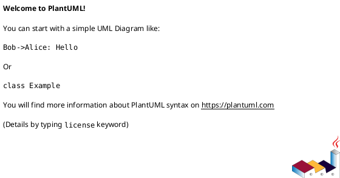

# <ADR_ID> <ADR_TITLE>

## 結論（Decision） (必須)
- **未決（TBD）**: この ADR は「議題が上がった時点」で作成し、結論はユーザー/レビュアーが最終決定した後に更新する。
- （注意）コーディングエージェントは、ユーザーの明示的な決定なしに結論を埋めない。
- ステータス運用:
  - 結論が未決の間は `状態: draft` のままにする
  - 結論が確定したら `accepted` にする
- 決定（決定後に記入）:
  - ...

## 背景（Context） (必須)
- 背景/制約（なぜ今決める必要があるか）:
  - ...
- 前提:
  - ...

### UML（任意） (任意)

## 選択肢（Options considered） (必須)
- Option A:
  - 概要:
    - ...
  - Pros:
    - ...
  - Cons:
    - ...
  - 棄却理由（棄却する場合）:
    - ...
- Option B:
  - 概要:
    - ...
  - Pros:
    - ...
  - Cons:
    - ...
  - 棄却理由（棄却する場合）:
    - ...

### UML（任意） (任意)

## 判断理由（Rationale） (必須)
- ...

### UML（任意） (任意)

## 影響（Consequences） (必須)
- Positive（良い点）:
  - ...
- Negative / Debt（悪い点 / 将来負債）:
  - ...
- 影響範囲（コード/テスト/運用/データ）:
  - ...
- 移行/ロールバック:
  - ...
- Follow-ups（追加の Epic/Issue/ADR）:
  - ...

### UML（任意） (任意)

## 参考（References） (任意)
- 関連仕様（requirement/design/plan/report）:
  - ...
- PR/実装:
  - ...
- 外部資料:
  - ...

### UML（任意） (任意)

