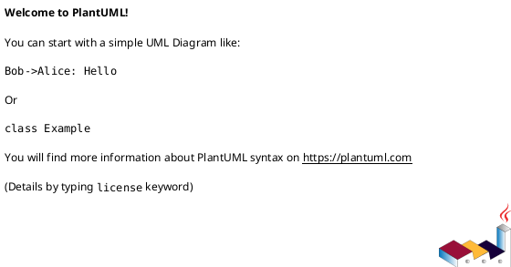

# <EPIC_ID> <EPIC_TITLE> — 要件定義（WHAT / WHY）

## 目的（Initiativeとの紐づき） (必須)
- Initiative のどの Goal / Metric に効くか:
  - ...
- この Epic が提供する能力（E2E）:
  - ...

## ユースケース（User journeys） (必須)
- Happy path:
  - ...
- 例外/運用シナリオ:
  - ...

### UML（任意） (任意)

## 要求（Epic-level requirements） (必須)
> “Issueに分割して実装される前提の、E2E要求” を列挙する。

- E-RQ-001（MUST|SHOULD|COULD）: ...
- E-RQ-002（MUST|SHOULD|COULD）: ...

## 受け入れ条件（Epic DoD / E2E） (必須)
- E-AC-001:
  - Given: ...
  - When: ...
  - Then: ...
  - 観測点（UI/HTTP/DB/Log 等）:
    - ...
- E-AC-002:
  - ...

## スコープ (必須)
- MUST:
  - ...
- MUST NOT:
  - ...
- OUT OF SCOPE:
  - ...

## 境界（Always / Ask / Never） (必須)
- Always（常に守る）:
  - ...
- Ask（迷ったら相談）:
  - ...
- Never（絶対にしない）:
  - ...

## 非機能要件（NFR） (必須)
- 性能:
  - ...
- 信頼性/整合性:
  - ...
- セキュリティ:
  - ...
- 運用性（監視/アラート/Runbook）:
  - ...

## 依存 / 影響範囲 (必須)
- 影響コンポーネント（FE/BE/DB/ジョブ/外部連携）:
  - ...
- 外部依存（他チーム/外部API/権限/契約）:
  - ...
- 互換性（破壊的変更の有無 / バージョニング方針）:
  - ...

## リスク/懸念（Risks） (任意)
- R-001: <リスク>（影響: ... / 対応: ...）
- ...

## 未確定事項（TBD） (必須)
- Q-001:
  - 質問: TBD ...
  - 選択肢:
    - A: ...
    - B: ...
  - 推奨案（暫定）:
    - ...
  - 影響範囲:
    - E-RQ / E-AC / スコープ / NFR / 依存 / ...

## Definition of Ready（着手可能条件） (必須)
- [ ] Initiative との紐づき（Goal/Metric）が明記されている
- [ ] E-RQ と E-AC があり、E2Eで観測可能な形になっている
- [ ] MUST/MUST NOT/OUT OF SCOPE が書けている
- [ ] Always/Ask/Never が書けている
- [ ] NFR が書けている（該当なしの場合は理由がある）
- [ ] 依存/影響範囲が書けている
- [ ] 未確定事項が「質問/選択肢/推奨案/影響範囲」で整理されている

## Definition of Done（完了条件） (必須)
- E-AC が満たされている（統合動作として確認できる）
- （必要なら）ロールアウト/移行が完了している
- （必要なら）監視/アラート/Runbook が整備されている
- フォローアップが Issue として切られている（必要な分）

## 省略/例外メモ (必須)
- 該当なし
