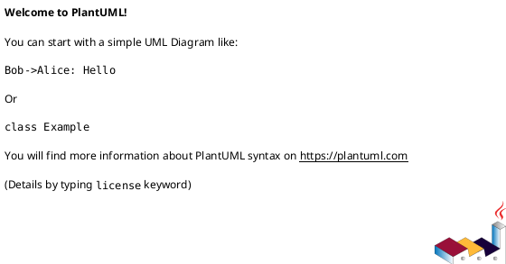

# <INIT_ID> <INIT_TITLE> — 設計（HOW / Guardrails）

## アーキテクチャ上の狙い（Architectural drivers） (必須)
- 例: スケール / 変更容易性 / 運用性 / コスト / 監査性
- ...

## 現状の把握（As-Is） (必須)
- システム構成（簡易）:
  - ...
- 主要な問題の根（ボトルネック/技術的負債/運用負債）:
  - ...

## 目指す姿（To-Be） (必須)
- To-Be 概要（文章でOK。図は必要なら各セクション内の UML 小項目に）:
  - ...
- 境界（モジュール/責務/データ境界の方針）:
  - ...

### UML（任意） (任意)

## システム境界 / 依存（Context） (必須)
- 対象範囲（in scope のシステム/モジュール）:
  - ...
- 外部依存（他サービス/外部API/チーム）:
  - ...
- 互換性の方針（後方互換/段階移行/破壊的変更の扱い）:
  - ...

### UML（任意） (任意)

## ガードレール（Must-follow constraints） (必須)
- 互換性（API/データ）:
  - ...
- セキュリティ（権限/監査/PII）:
  - ...
- 観測性（ログ/メトリクス/トレース）:
  - ...
- 品質ゲート（必須テスト/レビュー条件）:
  - ...

## 契約（外部I/F・データ境界） (必須)
- 外部I/F（API/イベント/ファイル等）:
  - ...
- データ境界（どこが正で、どこまで整合性を要求するか）:
  - ...

## 移行 / ロールアウト方針（原則） (必須)
- 移行戦略（例: expand/contract）:
  - ...
- Feature flag 方針:
  - ...
- ロールバック方針（戻せない場合の扱い）:
  - ...

## 観測性（Observability） (必須)
- ログ（必須キー、マスキング、サンプリング）:
  - ...
- メトリクス（成功/失敗/レイテンシ/キュー長など）:
  - ...
- アラート（SLO/しきい値/対応導線）:
  - ...

## 非機能（NFR）設計（性能/可用性/監査/セキュリティ） (必須)
- 性能:
  - ...
- 可用性/信頼性:
  - ...
- 監査:
  - ...
- セキュリティ:
  - ...

## 主要リスクと軽減策 (必須)
- R-001: <リスク>（影響: ... / 対応: ...）
- R-002: ...

## ADR index（意思決定の一覧） (必須)
- adr-xxxx-...: <1行要約>
- ...

## 未確定事項（TBD） (必須)
- Q-001:
  - 質問: TBD ...
  - 選択肢:
    - A: ...
    - B: ...
  - 推奨案（暫定）:
    - ...
  - 影響範囲:
    - ガードレール / 互換性 / 移行 / 観測性 / ...

## 省略/例外メモ (必須)
- 該当なし
