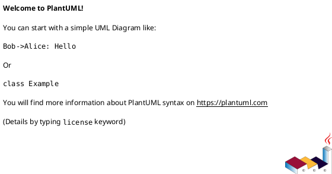

# <INIT_ID> <INIT_TITLE> — 計画（Roadmap / Epics）

## ロードマップ（マイルストーン） (必須)
- M1: YYYY-MM-DD - <deliverable>
- M2: YYYY-MM-DD - <deliverable>
- ...

## Epic 分解（候補） (必須)
- epic-xxxx-...:
  - 狙い（どの Goal/Metric に効くか）:
    - ...
  - 成果物（E2Eで提供するもの）:
    - ...
  - 依存:
    - ...
- epic-xxxx-...:
  - ...

## 順序と理由（Sequencing） (必須)
- なぜこの順番か（依存/リスク/価値提供）:
  - ...
- 並行できるもの / できないもの:
  - ...

### UML（任意） (任意)

## 計測計画（Metrics plan） (必須)
- 計測開始（いつから）:
  - ...
- 計測場所（ダッシュボード/ログ/監視）:
  - ...
- 成功/失敗の判断タイミング:
  - ...

## ロールアウト計画（Feature flag / 段階移行） (必須)
- Feature flag:
  - ...
- 段階公開（カナリア/一部テナント/内部先行など）:
  - ...
- ロールバック:
  - ...

## Epic Definition of Ready（Epicに求める着手可能条件） (必須)
- [ ] Epic が Initiative requirement の Goal/Metric に紐づいている
- [ ] Epic requirement に E2E の受け入れ条件（Epic DoD）がある
- [ ] Epic design に契約/API/データ/移行/観測性/テスト戦略の背骨がある
- [ ] Epic plan に Issue 分割（順序/依存/品質ゲート）がある
- [ ] 未確定事項が「質問/選択肢/推奨案/影響範囲」で整理されている

## 依存関係 / ブロッカー (必須)
- D-001: <依存/ブロッカー>（解消条件: ... / 期限: ...）
- D-002: ...

## リスク対応計画（Top risks） (任意)
- R-001: <リスク>（対応: ...）
- ...

## 未確定事項（TBD） (必須)
- Q-001:
  - 質問: TBD ...
  - 選択肢:
    - A: ...
    - B: ...
  - 推奨案（暫定）:
    - ...
  - 影響範囲:
    - ロードマップ / Epic分解 / ロールアウト / 計測 / ...

## 省略/例外メモ (必須)
- 該当なし
