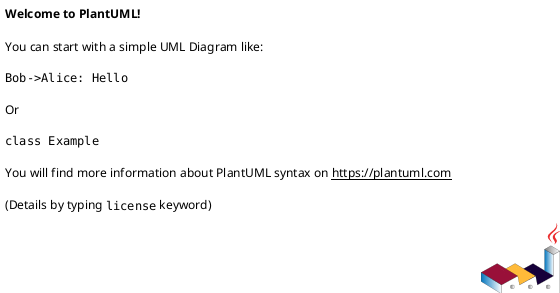

# <INIT_ID> <INIT_TITLE> — 要件定義（WHAT / WHY）

## 目的（Outcome / To-Be） (必須)
- Primary（必達）:
  - ...
- Secondary（できれば達成）:
  - ...

## 背景・現状（As-Is / 調査メモ） (必須)
- 現状の課題（事実）:
  - ...
- 影響（ユーザー/運用/コスト/品質）:
  - ...
- なぜ今やるか（トリガー/期限/機会損失）:
  - ...
- 観測点（どこを見て確認するか）:
  - ...
- 情報源（ヒアリング/ログ/コード/ドキュメント等の根拠）:
  - ...

### UML（任意） (任意)

## 成功指標（Success metrics） (必須)
- Metric 1:
  - Baseline（現状値）:
  - Target（目標値）:
  - 計測方法（どこで/どう測るか）:
  - 計測期間（いつからいつまでで判断するか）:
- Metric 2:
  - ...

## スコープ（暴走防止のガードレール） (必須)
- MUST:
  - ...
- MUST NOT:
  - ...
- OUT OF SCOPE:
  - ...

## 非交渉制約（NFR/運用/セキュリティ） (必須)
- 例: 互換性（API/データ）:
- 例: 性能（p95, バッチ時間など）:
- 例: 信頼性（再実行、冪等性、整合性モデル）:
- 例: セキュリティ（権限/監査ログ/PII）:
- 例: 運用性（監視/アラート/Runbook）:
- ...

## 境界（Always / Ask / Never） (必須)
- Always（常に守る）:
  - ...
- Ask（迷ったら相談）:
  - ...
- Never（絶対にしない）:
  - ...

## ステークホルダー / 影響範囲 (必須)
- 利用者（ロール/部署）:
  - ...
- 運用者（SRE/CS/監視）:
  - ...
- 開発者（担当領域）:
  - ...
- 影響範囲（システム/モジュール/外部連携）:
  - ...

## 制約・前提（Constraints / Assumptions） (必須)
- 技術制約:
  - ...
- ビジネス制約:
  - ...
- 法務/セキュリティ:
  - ...
- 不確実な前提（崩れた場合の影響）:
  - ...

## Initiative-level requirements（能力/成果の要求） (任意)
> “機能詳細” ではなく「この取り組みで得たい成果/能力」を列挙する。実装方法はここに書かない。

- I-RQ-001: ...
- I-RQ-002: ...

## リスク/依存（Risks / Dependencies） (必須)
- R-001: <リスク/依存>（影響: ... / 対応: ...）
- R-002: ...

## 未確定事項（TBD / 要確認） (必須)
- Q-001:
  - 質問: TBD ...
  - 選択肢:
    - A: ...
    - B: ...
  - 推奨案（暫定）:
    - ...
  - 影響範囲:
    - Metric / スコープ / 制約 / Epic分解 / ...

## Definition of Ready（着手可能条件） (必須)
- [ ] 目的（Primary/Secondary）が明記されている
- [ ] 成功指標（Baseline/Target/計測方法/計測期間）が決まっている
- [ ] MUST/MUST NOT/OUT OF SCOPE が書けている
- [ ] Always/Ask/Never が書けている
- [ ] リスク/依存が列挙され、最低限の対応方針がある
- [ ] 未確定事項が「質問/選択肢/推奨案/影響範囲」の形で整理されている

## Definition of Done（完了条件） (必須)
- 成功指標が計測され、目標達成/未達が判断できる
- （必要なら）ロールアウト完了（段階公開/移行完了）
- （必要なら）運用（監視/アラート/手順）が整備されている
- フォローアップが Epic/Issue として切られている（必要な分）

## 省略/例外メモ (必須)
- 該当なし
